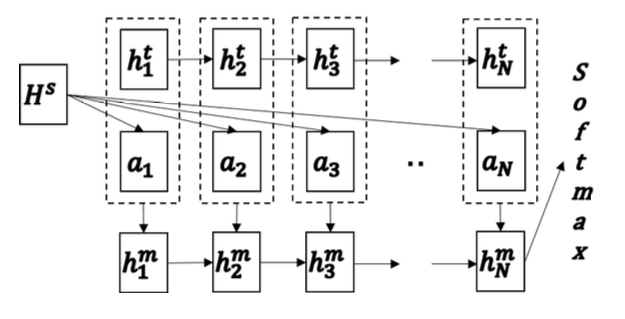

# SeqMatchSeq in Tensorflow

This is a tensorflow implementation of SeqMatchSeq model in [Learning Natural Language Inference with LSTM](https://arxiv.org/abs/1512.08849).  

## Environments

* Python 3.x
* TensorFlow 1.2.x

## Pre-trained Word Vectors

I use glove.6B shared by Jeffrey Pennington et al.. It can be found at [link](https://nlp.stanford.edu/projects/glove/).

## Data

The data used is Stanford Natural Language Inference (SNLI) corpus which can be downloaded at [link](https://nlp.stanford.edu/projects/snli/).

## Usage

abandoning useless word vectors

$ python customize_embedding.py --data_dir DATA_DIR --embedding_path EMBEDDING_PATH

training

$ python natural_language_inference.py --ARG=VALUE

evaluating

$ python natural_language_inference.py --forward_only=True --ARG=VALUE

visualizing

$ tensorboard --logdir=DIR

## Results

Currently, I can only achieve \~72% correct rate on dev set (5\~10 epochs). I suspect that the main reason is that I did not carefully process words so that only 37.56% vocabulary (train+dev+test) was covered by pre-trained vocab vectors. Also using a <UNK> token to represent all the unknown words instead of taking the average over surrounding words might be another reason.  Anyway I have modified the procedure of obtaining words and now 80.84% vocabulary is covered. I am re-training the model but it takes time.
